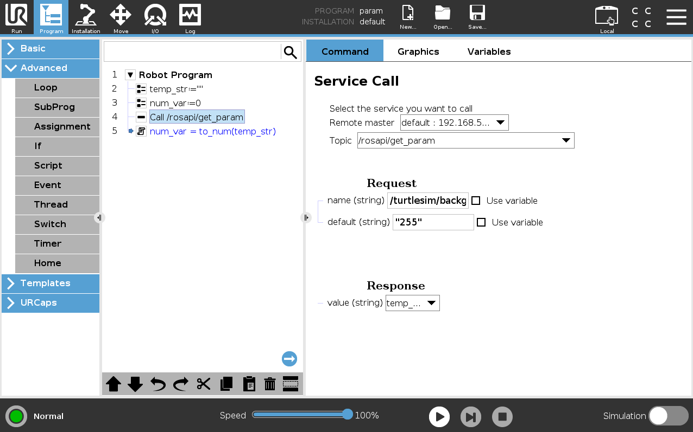

# ROS as a Service

 

This URCaps allows you to call ROS `services`, `actions` and use `topics`
from within your Universal Robots application setup on the Teach panel. The main program will stay on the robot while
you can integrate features provided by ROS nodes over the network.
The idea is to combine the _best of both worlds_.
For instance, a computational intense AI application in the ROS
framework could provide the poses of work pieces, which are then used by the
main program running on the robot.

## Prerequisites
This URCap uses Swing to implement the user interface and requires
PolyScope versions 3.7 (UR3, UR5, UR10) or 5.1 (E-series) or higher.

## Installation
The installation is described in a [separate guide](doc/installation.md)


## Quick start
This URCap implements a client for the [Rosbridge server](http://wiki.ros.org/rosbridge_server) to
connect to a running ROS ecosystem.
Every part of the bi-directional communication goes over that bridge and uses
the common ROS messaging mechanisms as abstraction.
Note that your _ROS side_ must be all set and running when you compose your program in
PolyScope. Available ROS interfaces are parsed and can then be chosen in drop-down menus on the teach panel.

Follow the instructions below to use ROS functionality directly from within
your Polyscope programs. For more detailed instructions see the separate
[tutorial](doc/tutorial.md).


1. Prepare your _ROS side_ by launching the Rosbridge server:
    ```bash
    roslaunch rosbridge_server rosbridge_tcp.launch
    ```

2. In the _Installation_ tab of Polyscope:

   Under _URCaps_ on the left, select the _Rosbridge adapter_ and adjust the remote host's IP address and port (If you didn't change it, it should be 9090).
   Use `ip addr` on your ROS PC in a terminal if you are unsure about your PC's IP address in the network. Pick the IP address
   of the interface that is connected to the robot. (Your robot's IP address should be similar, as they are in the same subnet.)

3. In the _Program_ tab of Polyscope:

   Add program nodes to publish or read data from topics or calling a ROS service to your program.
   Setup variable mapping where desired.

## Troubleshooting
### Array types are currently unsupported!
When you select a topic (either in the Publisher, Subscriber, Service Caller or Action Caller) and a
field doesn't have an input field but shows *"Array types are currently unsupported!"* that's
because they are currently not implemented. See
[#26](https://github.com/UniversalRobots/Universal_Robots_ROS_as_a_Service_URCap/issues/26) for details

### Working with ROS parameters
Working with parameters is currently not fully supported. Only parameters of type String will work
as expected. Reasons for that are explained below.

While the [rosbridge protocol](https://github.com/RobotWebTools/rosbridge_suite/blob/develop/ROSBRIDGE_PROTOCOL.md)
does not contain separate calls for ROS parameter retrieving or manipulation, it offers a couple of
services around getting and setting parameters. However, the [`GetParam` service](https://github.com/RobotWebTools/rosbridge_suite/blob/develop/rosapi/srv/GetParam.srv)
will return the parameter's value encapsulated inside a String. So, in order to get a numeric
parameter you will have to get the parameter into a string variable and then convert it to a numeric
variable afterwards. See the example program below, where we want to read the value of the parameter
`/turtlesim/background_b` into `num_var`.



Similarly setting parameters will only work for String parameters, as setting a parameter doesn't
check the existing type, but writes the value received (which is always a String due to the
[`SetParam`
service](https://github.com/RobotWebTools/rosbridge_suite/blob/develop/rosapi/srv/SetParam.srv))
directly into the parameter.

### Received String exceeds maximum length (1023 Bytes).
If you get a popup message saying "Received String exceeds maximum length (1023 Bytes)." that's
unfortunately a limitation of the current implementation / URScript. See
https://github.com/UniversalRobots/Universal_Robots_ROS_as_a_Service_URCap/blob/master/doc/missing_features.md#the-maximum-string-length-of-urscript-is-1023-characters
for details.

If you get this error, this could have multiple sources depending on the call triggering this. As
the [rosbridge
protocol](https://github.com/RobotWebTools/rosbridge_suite/blob/develop/ROSBRIDGE_PROTOCOL.md)
is mostly request-based the source is either an answer to a request (e.g. Service response, topic
list, etc.) or message being sent to the robot e.g. via a subscriber or action client. The only way
to workaround this is to make sure that the message is shorter. For example, if the message contains
a very long string and you can influence the string's content, make sure it gets shorter.

In situations where you don't have access to the message source, you could write your own relay node
that subscribes to the original message and re-publishes the message content to a self-defined
message without the long (text) part. Your robot program could then subscribe to this re-published
message.

## Acknowledgments

Developed in collaboration between:

[](https://www.universal-robots.com/) &nbsp; and &nbsp;
[](https://www.fzi.de).

<!--
    ROSIN acknowledgement from the ROSIN press kit
    @ https://github.com/rosin-project/press_kit
-->

<a href="http://rosin-project.eu">
  
</a>

Supported by ROSIN - ROS-Industrial Quality-Assured Robot Software Components.
More information: <a href="http://rosin-project.eu">rosin-project.eu</a>


This project has received funding from the European Union’s Horizon 2020
research and innovation programme under grant agreement no. 732287.

