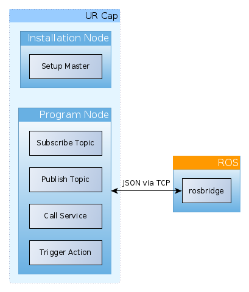
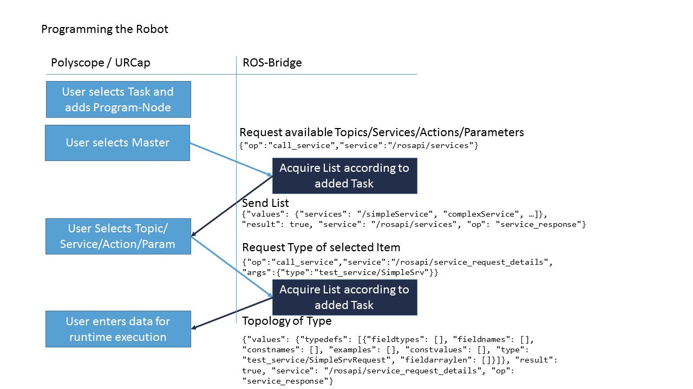

# Design Considerations

This document describes the design of the "ROS as a service".

The basic idea is to keep the teach pendant program the main execution point while still leveraging advanced functionality through ROS.

---
## Available components
To leverage ROS inside a robot program, the following components will be made available by this extension.

### ROS-Topic Subscriber
By selecting a Master and a related Topic it is possible to subscribe to this topic. The received result gets parsed according to a user defined data handling.
 - select ROS master
 - topic selector
 - Data handling for received data

#### Behaviour
  - Runtime error if no connection to backend
  - on enter wait for message from backend and process

#### General idea of generated UR-Script
  - generate Method to parse received data according to user defined data handling
  - open socket for communication
  - subscribe to topic
  - while no message received
      - wait/receive message
  - parse received data
  - unsubscribe from topic
  - close socket

### ROS-Topic publisher
By selecting a master and a related topic a message can be broadcasted to that topic. Values in this topic can be either constant values or variables from the UR Environment.
  - select ROS master
  - topic selector
  - Data template for data to send

#### Behaviour
  - Runtime error if no connection to backend
  - on enter send data to be published to backend

#### General idea of generated UR-Script
  - open socket for communication
  - advertise topic
  - send message
  - unadvertise
  - close socket

### ROS-Service caller
Send a request for a service to the backend. The response is parsed according to the user defined Data handling.
  - select ROS master
  - service selector
  - Data template for service request similar to publisher
  - Data handling of response similar to subscriber

#### Behaviour
  - Runtime error if service unavailable
  - Runtime error if no connection to backend
  - on enter call service and wait for response

#### General idea of generated UR-Script
  - generate Method to parse received data according to userdefined data handling
  - open socket for communication
  - call service
  - wait/receive service response
  - check for timeout and success
      - fail: popup with error message
      - success: parse received data
  - close socket

### Action wrapper
Trigger an action through the backend. Feedback and result will be forwarded to robot.
  - select ROS master
  - action selector
  - Data template for action goal similar to publisher
  - Data handling for feedback and result similar to subscriber

#### Behaviour
  - Runtime error if action unavailable
  - Runtime error if no connection to backend
  - on enter call action, fetch feedback continuously and wait for result (blocking)

#### General idea of generated UR-Script
  - generate method for feedback parsing
  - generate method for result parsing
  - open socket for communication
  - subscribe to action feedback
  - subscribe to action result
  - while no result
    - wait/receive incoming data
    - parse incoming data
    - check result message for success of action
      - fail: popup with error message
  - unsubscribe from feedback and result
  - close socket

## Description of Functionality
### Master selector
Several ROS Masters at the same time shall be supported. For each Basic functionality (publish/subscribe/call/...) the ROS master shall be selectable from a list created in the URCap Installation Node.

### Topic selector
For each basic functionality the topic/service/action shall be selectable from a list. This list shall contain available topics from the selected Master.

### Data handling
For all ROS messages there shall be an input-method to enter data for each message field. There shall be a way to also use variables as in and outputs of URCap Program Nodes.
For incoming data (e.g. Subscriber) for each message field there shall be the opportunity to store the value in a variable

## Architecture

Overview of Communication with rosbridge

Workflow on how programming the robot works

### Backend (orange)
The backend can be realised using the rosbridge suite. This supports service- and actioncalls as well as topic and parameter handling via JSON on a TCP Socket. As the used protocol is well documented this also enables easy reuse in other frameworks than ROS.

### Frontend / URCap (blue)
#### Installation node
##### GUI
Setup remote servers
  - Setup remote server(s)
    - IP
    - Port
  - opt: Test connection (e.g. via test button)

##### Code contribution
The Code Contribution has two parts:
  - JSON Parser: All the functions needed to parse a JSON String in URScript
    - We suggest to prefix all parser functions with `json_`
  - in case there are Program-Nodes defined:
      - fetch a quote `"` from a ROS master as UR-Script does not support escape sequences

#### Program Nodes
##### GUI
See components above
  - the selected topic/action/... layout is stored in the node's model
  - the data handling is also stored in the model
##### Code contribution
See components above
