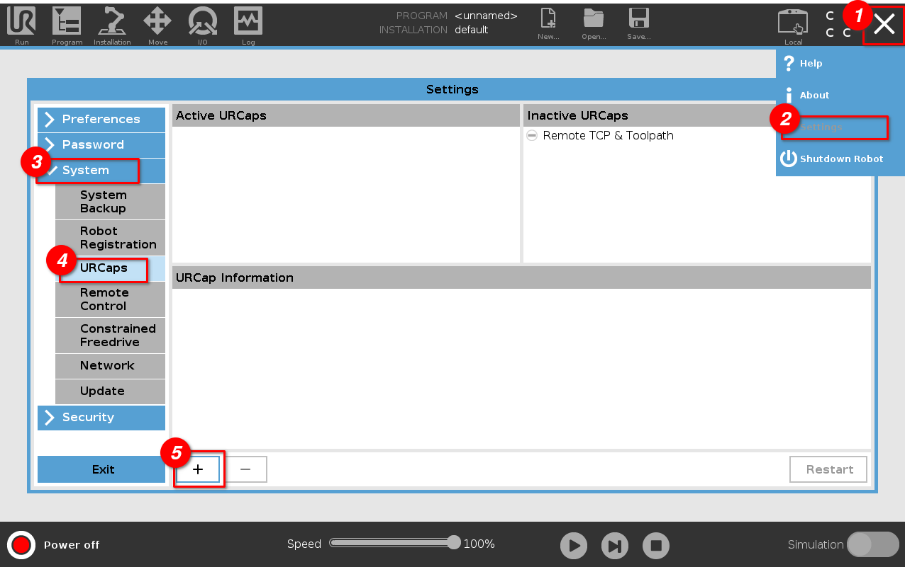

# Installation

For installing, follow those steps:

1. Download the [latest
   release](https://github.com/UniversalRobots/Universal_Robots_ROS_as_a_Service_URCap/releases/latest)
   (Download the _ros_as_a_service-x.y.urcap_ file under "Assets")
2. Copy the downloaded file to a USB flash drive
3. Insert the USB stick into the USB port on the robot's teach pendant
4. On the welcome screen click on the hamburger menu in the top-right corner and select _Settings_
   to enter the robot's setup. There select _System_ and then _URCaps_ to enter the URCaps
   installation screen.
5. Click the little plus sign at the bottom to open the file selector. There you should see all
   urcap files stored inside the robot's programs folder or a plugged USB drive. Select the file you
   just copied onto the USB flash drive and click open. Your URCaps view should now show a new entry
   in the list of active URCaps and a notification to restart the robot. Do that now.
6. After the reboot the URCap should be installed and available. Continue with the setup as
   described in the [Getting started tutorial](tutorial.md)

