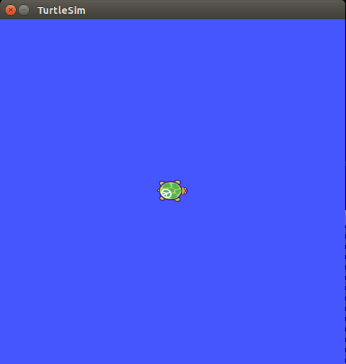

# Turtlebot

The tutorials from this package use the ROS turtle simulation.
This is an easy way to provide something to test the new functionality with.

Make sure that you have the package [turtlesim](http://wiki.ros.org/turtlesim)
installed on your ROS machine. Of course, you can use any other ROS node and use it similarly.
After having setup the rosbridge, run

    ```bash
    rosrun turtlesim turtlesim_node
    ```
in another terminal to bring up a graphical window of the turtle simulation.

Your turtle will look similar to this one:




