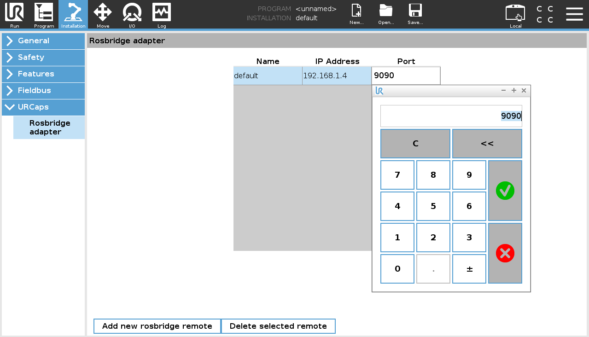

# How to use the ros_as_a_service URCap

This tutorial explains the usage of the _ros_as_a_service_ URCap with a running ROS system.

## Setup
### ROS PC
1. Prepare your _ROS side_ by launching the Rosbridge server:
   ```bash
   roslaunch rosbridge_server rosbridge_tcp.launch
   ```
   Rosbridge uses port `9090` by default. There should be an output similar to `[INFO] [1617114029.525786]: Rosbridge TCP server started on port 9090`.
   You'll need that port later in PolyScope.

2. This tutorial uses the [turtlesim](http://wiki.ros.org/turtlesim) package to have some functionality to test with.
   If you want to follow along, make sure that you have the package installed on your ROS machine. Of course, you can use any other ROS node and use it similarly.

   In another terminal, run

    ```bash
    rosrun turtlesim turtlesim_node
    ```
    to bring up a graphical window of the turtle simulation.

3. Find your ROS machine's IP address by using `ip addr`. The output should look similar as below with multiple interfaces. Find the interface your robot is connected to. Its IP address should be similar to the IP address setup on your robot, as they are in the same subnet.

   ```
   $ ip addr
   1: lo: <LOOPBACK,UP,LOWER_UP> mtu 65536 qdisc noqueue state UNKNOWN group default
    link/loopback 00:00:00:00:00:00 brd 00:00:00:00:00:00
    inet 127.0.0.1/8 scope host lo
       valid_lft forever preferred_lft forever
    inet6 ::1/128 scope host
       valid_lft forever preferred_lft forever
   2: eth0: <BROADCAST,MULTICAST,UP,LOWER_UP> mtu 1500 qdisc pfifo_fast state UP group default qlen 1000
    link/ether 08:00:27:8d:1c:01 brd ff:ff:ff:ff:ff:ff
    inet 192.168.1.4/24 brd 192.168.1.255 scope global eth0
       valid_lft forever preferred_lft forever
    inet6 fe80::a00:27ff:fe8d:1c01/64 scope link
       valid_lft forever preferred_lft forever

In this particular case out interface would be `eth0` with the IP address `192.168.1.4`.

### Polyscope

Next, set-up the network in the _Installation_ tab of Polyscope:

Under _URCaps_ on the left, select the _Rosbridge adapter_ and adjust the remote host's (The PC running your ROS system) IP address and port (If you didn't change it, it should be 9090).




## Publish on a topic

With this program node you can publish a message to an existing topic. Note, that it has to be advertised once before (so it is known by the rosbridge) it can be used on the teach pendant. Advertising new topics is currently not supported.

We create a new program in Polyscope under the _Program_ tab. Uncheck the checkbox for _Program loops forever_ so that our robot program gets executed only once.


Under _URCaps_ on the left

* chose _Publish Topic_ to add a ROS Publisher to the robot program and select its Remote master in the drop-down menu on the right.

* The drop-down menu for _Topic_ holds every topic that can be published to with this Publisher. This information is inquired from ROS when you add a new instance to your robot program. Select `/turtle1/cmd_vel` to steer the turtlebot in simulation.


A _Message_ tree should appear. You can open it by clicking on the icons left to the folders and fill the data types. The turtle simulator only uses the `linear x` and `angular z` fields.


In general, two options are available to fill the fields:

* The first one is by checking _Use variable_, which lets you re-use the content of specific variables to populate your outgoing message. This is handy if you want to pass information directly without manually editing anything. Variables can be either setup in the _Installation_ tab or by adding _Assign_ nodes before creating the _Publish Topic_ node (see below).

* The second option is to enter the values that should be used directly into the value field.


We now have configured our first ROS Publisher. Let's use it once by clicking _Play from beginning_.


Your turtle should move similar to this one:


## Read data from a topic

The _Subscribe Topic_ node subscribes to a specified topic, waits for a message to arrive and saves fields from that message to variables if desired.

Before adding a _Subscriber_ to our robot program, we set-up some variables that we can use as buffers for our data. Switch to the _Advanced_ tab on the left and select _Assignment_. This allows us to define variables in-place. Alternatively setup variables using the  _Installation_ tab.

In this example, we want to read the turtle's position and orientation from ROS.


Initialize the variable by inserting an _Expression_, which is simply 0 in this case.


Add two more variables as shown below.


Now we can add the ROS Subscriber by adding _Subscribe Topic_ to our robot program. Select the Remote master as before and _/turtle1/pose/_ as _Topic_.


You can now assign the variables we just created to the individual data fields. Data fields without a variable assignment will not be used in the program.


Clicking _Play from beginning_ should move your turtlebot.


If you used the values from this tutorial, your turtlesim window should look something like this:


You can inspect the result of our first ROS Subscriber by clicking on the _Variables_ tab. Note that these values _do not_ correspond to the turtlebot's final position! Instead, the result was read from ROS exactly when executing _Sub. /turtle1/pose_ in the robot program tree on the left.


